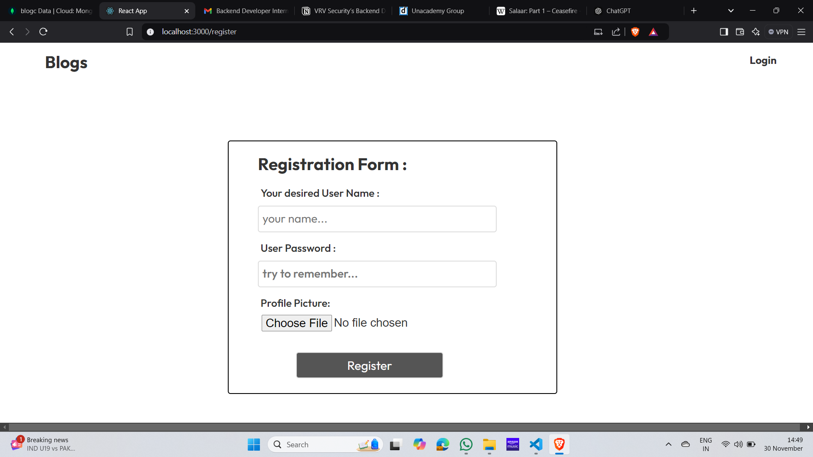
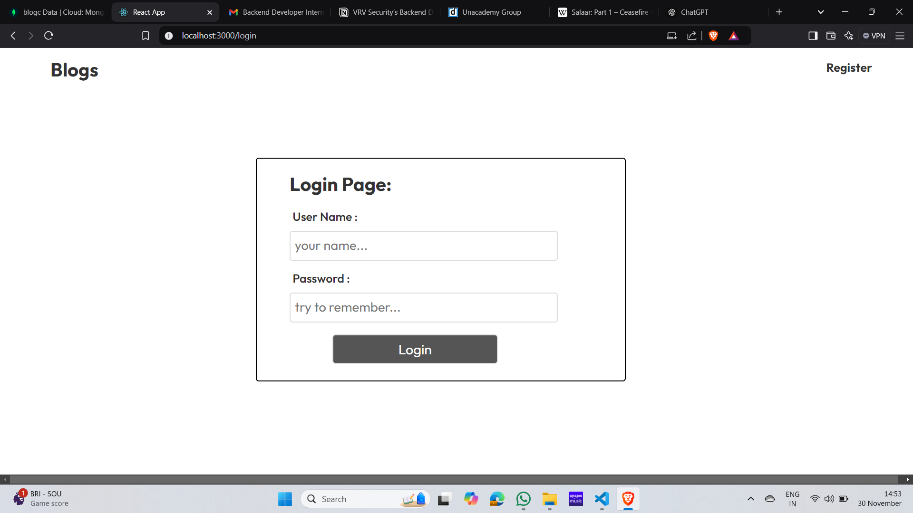
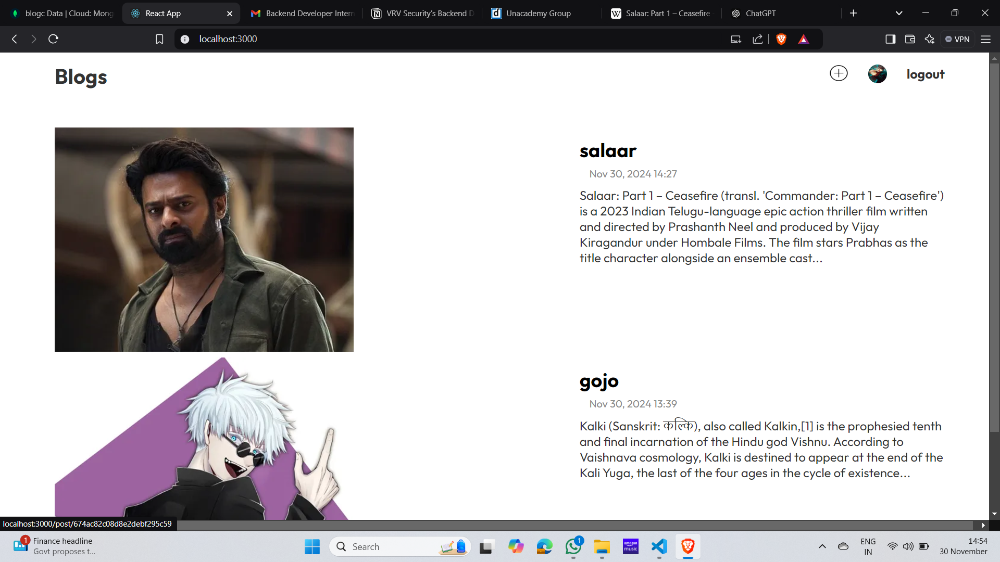
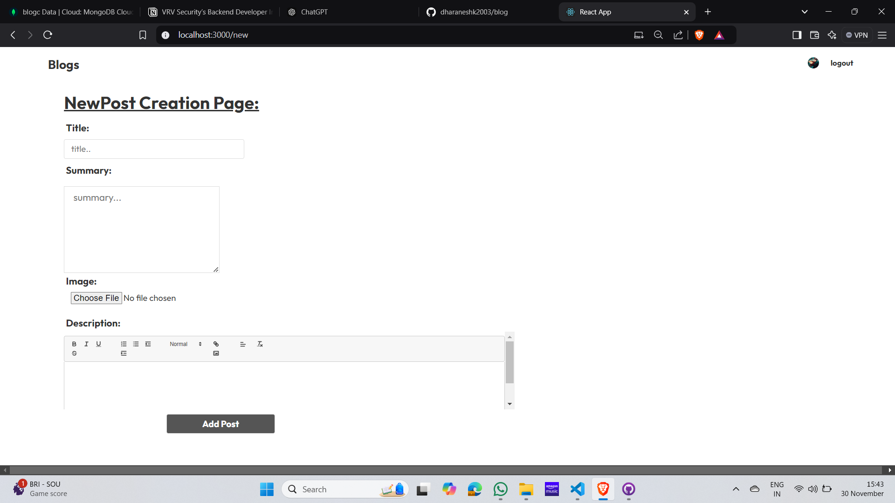
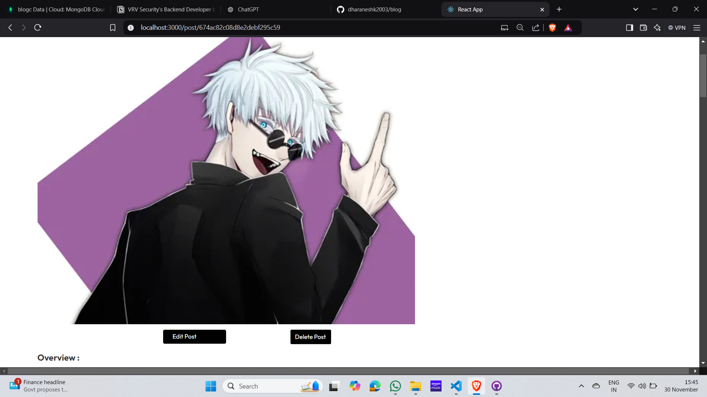
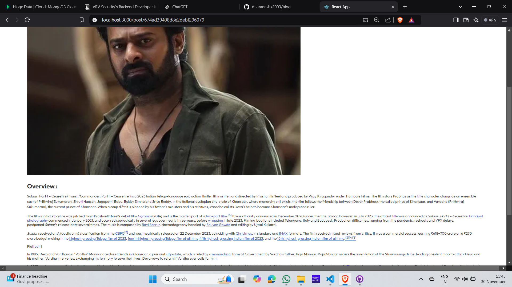
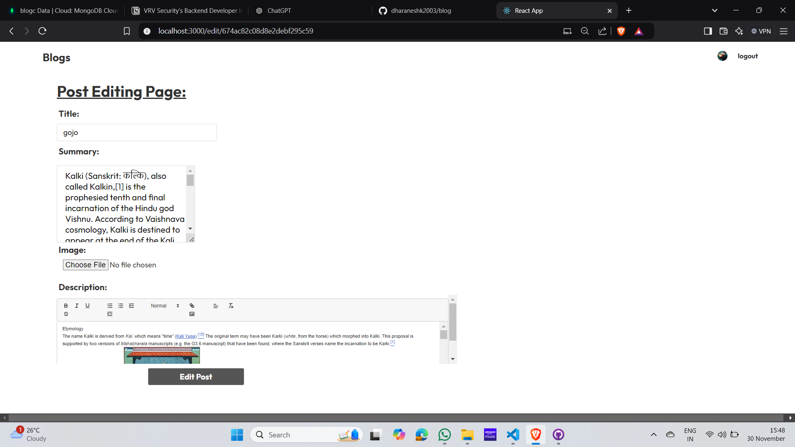
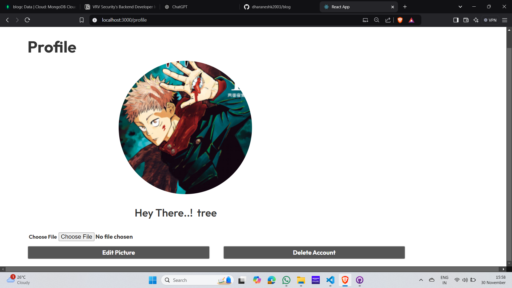

Here’s your improved README file, formatted for clarity and consistency:

---

# Blog Project

This is a full-stack blog application where users can create, edit, and manage blogs. The application includes user authentication, profile management, and CRUD functionalities for blogs.

---

## Features

### 1. Register Interface  
Users can create a new account by providing their details.  



---

### 2. Login Interface  
Registered users can log in to access the application's features.  

 

---

### 3. Main Page  
The main page displays a list of all blogs. Users can browse through the blogs but need to log in to create, edit, or delete blogs.  

 

---

### 4. Blog Creation Page  
Users can create a new blog by providing a title, summary, image, and content. This feature is accessible only to logged-in users.  

 

---

### 5. Specific Blog Page  
Displays the full content of a blog post.  
- If the logged-in user is the blog owner, **Edit** and **Delete** buttons appear.  
- Non-owners can only view the blog content.  

#### Example:
- **Logged-in user is the blog creator**  
    

- **Logged-in user is not the blog creator**  
    

---

### 6. Edit Page  
The edit functionality is restricted to the blog owner.  
- Users can update the title, summary, image, and content.  
- Other users cannot access this page.  

 

---

### 7. Profile Page  
Displays user-specific information, including:  
- Profile picture.  
- Options to delete the account or edit the profile picture.  
- **Editing the profile name is not allowed**.  

 

---

## How to Use

### Prerequisites  
- Node.js  
- MongoDB  

### Installation  
1. Clone the repository:  
   ```bash
   git clone https://github.com/yourusername/blog-project.git
   ```
2. Navigate to the project folder:  
   ```bash
   cd blog-project
   ```
3. Install dependencies for both frontend and backend:  
   ```bash
   npm install
   cd client
   npm install
   cd ..
   ```

### Running the Application  
1. Start the backend server:  
   ```bash
   npm run server
   ```
2. Start the frontend development server:  
   ```bash
   cd client
   npm start
   ```

---

## Tech Stack  
- **Frontend**: React  
- **Backend**: Node.js, Express  
- **Database**: MongoDB  
- **Authentication**: JWT  

---

### NOTE:  
Create a `.env` file on the server-side to include your **MONGODB_URL** if you want to start this project from scratch.

---

## Implementation of Role-Based Access Control (RBAC)

### Roles:  
- **Not signed-in users**  
- **Account holders**

### Permissions:
1. **Not signed-in users**:  
   - Can read all blogs.  
   - Cannot modify or create any blogs.  

2. **Account holders**:  
   - Can read all blogs.  
   - Can create, edit, and delete their own blogs.  
   - Can change their profile picture.  
   - Can delete their own account.  

---
